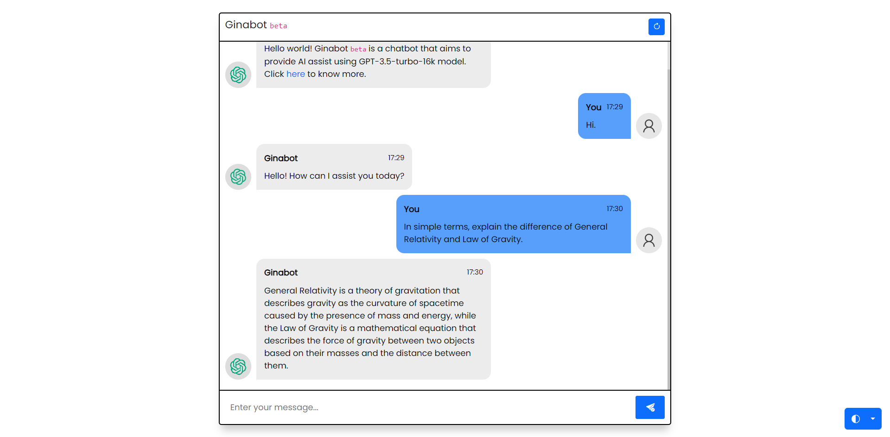
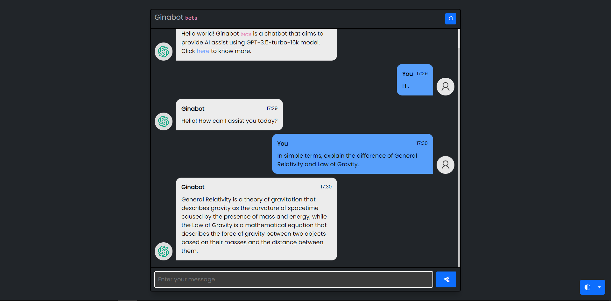

# Flask-GPT <code> <small>demo</small> </code>
<!-- A collection of basic Django web applications for beginners. -->

## About

A light-weight project that demonstrates pre-programmed chatbot  by utilizing the GPT3.5 Turbo model and Chat Completions.

---

## Installation

1. Clone reporsitory.

```bash
$ git clone https://github.com/kitimi88/flask-gpt-demo.git
```

2. Setup virtual environment.

```bash
$ py -m venv .venv
$ .venv\scripts\activate
```
3. Install required dependecies.

```bash
$ py -m pip install -r requirements.txt
```
4. Make a copy of the example environment variables file:

```bash
$ cp .env.example .env
```

5. Add your [API key](https://beta.openai.com/account/api-keys) to the newly created `.env` file.

6. Run app:

```bash
$ flask run
```
**IMPORTANT** - By default, this project is powered by gpt-3.5-turbo-16k model. Feel free to adjust according to your preferred model in the [gpt.py](gpt.py).
```bash
$ MODEL = "your-preferred-gpt-model"
```
---
## References and documentations

* [Flask](https://flask.palletsprojects.com/en/2.3.x/)
* [Bootstrap](https://getbootstrap.com/)
* [Git for Windows](https://gitforwindows.org/)
* [Openai (API Reference)](https://platform.openai.com/docs/api-reference)

---
## Screenshots
Supports color themes using [Bootstrap 5.3](https://getbootstrap.com/docs/5.3/customize/color-modes/).




---
## Contributions
_Pending contribution guide._
***
## License
[MIT License](/LICENSE)

---
Check out my other [respository](https://github.com/kitimi88?tab=repositories) for more python projects.

